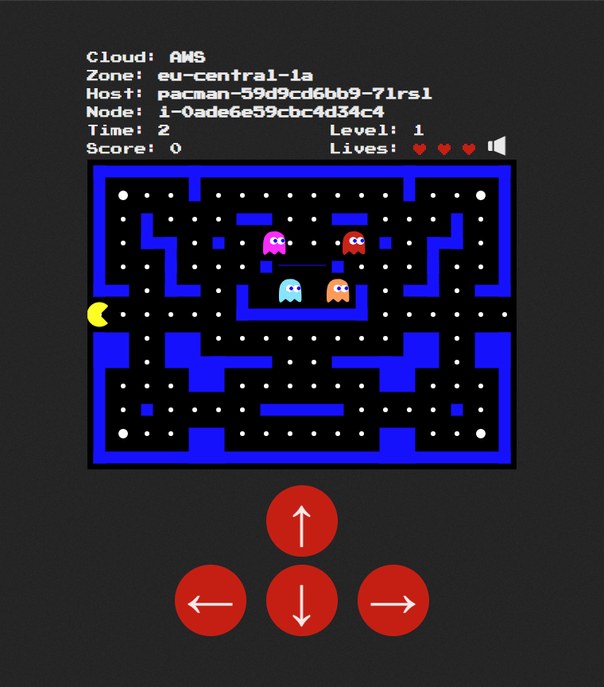
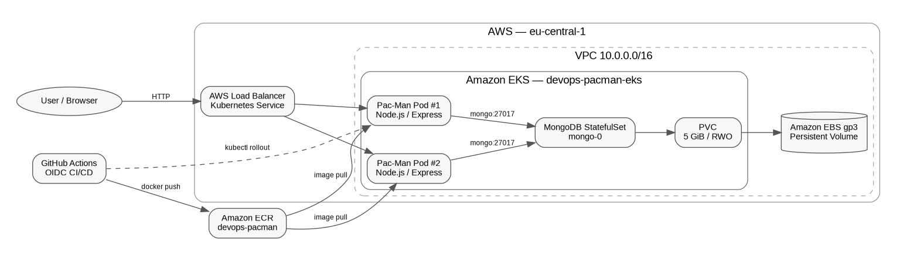
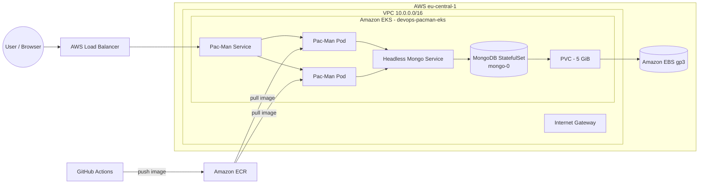
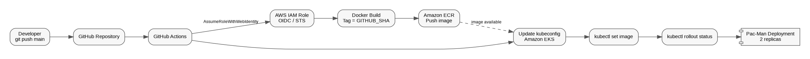
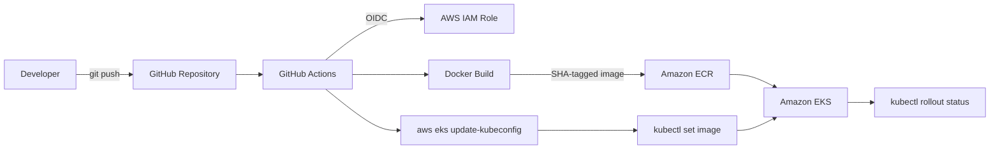
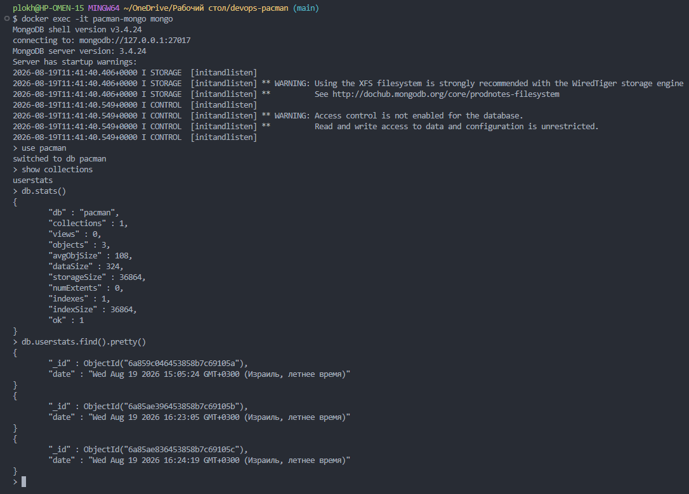

# DevOps Pac-Man on Amazon EKS


A DevOps implementation of the open-source Pac-Man application,
containerized with Docker and deployed to **Amazon EKS**. Infrastructure
is provisioned with **Terraform**, application releases are automated
through **GitHub Actions using AWS OIDC**, and MongoDB runs as a
**Kubernetes StatefulSet with persistent EBS storage**.

The application also exposes its runtime infrastructure metadata
directly in the game UI: **cloud provider, availability zone, Pod
hostname, and EKS node**.

> **Assignment status:** the core AWS/EKS infrastructure, application
> deployment, CI/CD pipeline, LoadBalancer exposure, MongoDB StatefulSet
> and persistent storage are implemented and tested. **Prometheus +
> Grafana monitoring is the remaining assignment requirement and is not
> represented here as completed.**

------------------------------------------------------------------------

## Demo

The deployed application is exposed through an AWS-backed Kubernetes
`LoadBalancer` service.

Example runtime metadata returned by the application:

``` json
{
  "cloud": "AWS",
  "zone": "eu-central-1a",
  "host": "pacman-59d9cd6bb9-7lrsl",
  "node": "i-0ade6e59cbc4d34c4"
}
```

The hostname and node are intentionally dynamic: Pods and EKS compute
nodes can be replaced while the application remains available.

### Running application



### Persisted high score


------------------------------------------------------------------------

## Architecture



The project uses a Terraform-managed VPC in `eu-central-1` with public
subnets across availability zones `eu-central-1a` and `eu-central-1b`.
Amazon EKS runs the application workload and MongoDB workload. Pac-Man
is deployed with multiple replicas, while MongoDB uses a StatefulSet and
a dynamically provisioned `gp3` EBS volume.



A draw.io-editable version is included at:

`docs/diagrams/architecture.drawio`

------------------------------------------------------------------------

## CI/CD Pipeline



A push to `main` starts the GitHub Actions workflow. GitHub
authenticates to AWS through **OIDC / `AssumeRoleWithWebIdentity`**, so
the workflow does not require long-lived AWS access keys.



The image tag is the Git commit SHA, giving each deployment a direct
link back to source control.

A draw.io-editable version is included at:

`docs/diagrams/cicd-pipeline.drawio`

------------------------------------------------------------------------

## Technology Stack

  Area                     Technology
  ------------------------ -------------------------------------
  Cloud                    AWS
  Infrastructure as Code   Terraform
  Containers               Docker
  Container registry       Amazon ECR
  Orchestration            Kubernetes / Amazon EKS
  Application              Node.js / Express
  Database                 MongoDB 3.4.24
  Persistent storage       Amazon EBS `gp3`, Kubernetes PV/PVC
  CI/CD                    GitHub Actions
  AWS authentication       GitHub OIDC → IAM role
  Exposure                 Kubernetes `LoadBalancer` service
  Source control           Git / GitHub

------------------------------------------------------------------------

## Repository Structure

``` text
devops-pacman/
├── .github/
│   └── workflows/
│       └── main.yml
├── k8s/
│   ├── mongodb/
│   │   ├── service.yaml
│   │   ├── statefulset.yaml
│   │   └── storage-class.yaml
│   └── pacman/
│       ├── deployment.yaml
│       ├── rbac.yaml
│       └── service.yaml
├── terraform/
│   ├── main.tf
│   ├── outputs.tf
│   ├── providers.tf
│   ├── variables.tf
│   └── versions.tf
├── docs/
│   ├── diagrams/
│   │   ├── architecture.drawio
│   │   ├── architecture.png
│   │   ├── cicd-pipeline.drawio
│   │   └── cicd-pipeline.png
│   └── screenshots/
├── public/
├── routes/
├── Dockerfile
├── package.json
└── README.md
```

------------------------------------------------------------------------

## Infrastructure as Code

Terraform provisions/manages the AWS infrastructure used by the project,
including:

-   VPC `10.0.0.0/16`
-   public subnet `10.0.1.0/24` in `eu-central-1a`
-   public subnet `10.0.2.0/24` in `eu-central-1b`
-   Internet Gateway and public routing
-   Amazon EKS cluster `devops-pacman-eks`
-   Amazon ECR repository `devops-pacman`
-   EKS/IAM roles and policy attachments
-   GitHub Actions IAM role and ECR/EKS permissions
-   EKS access entry for the CI/CD role

Typical workflow:

``` bash
cd terraform
terraform init
terraform validate
terraform plan
terraform apply
```

Useful outputs:

``` bash
terraform output cluster_name
terraform output cluster_endpoint
terraform output ecr_repository_url
terraform output github_actions_role_arn
```

------------------------------------------------------------------------

## GitHub Actions and AWS OIDC

The pipeline uses GitHub's OIDC identity token to assume a dedicated AWS
IAM role.

This avoids storing static AWS access-key credentials in the GitHub
repository.

Pipeline sequence:

1.  Checkout the repository.
2.  Assume the AWS CI/CD role using OIDC.
3.  Authenticate Docker to Amazon ECR.
4.  Build the application image.
5.  Tag the image with `${GITHUB_SHA}`.
6.  Push the image to ECR.
7.  Generate the EKS kubeconfig.
8.  Update the `pacman` Deployment image.
9.  Wait for the Kubernetes rollout to complete.

A successful test deployment changed the application's control buttons
from **red to blue** after a normal `git push`, demonstrating the
complete source → build → ECR → EKS deployment path.


------------------------------------------------------------------------

## Kubernetes Workloads

### Pac-Man

The Pac-Man application runs as a Kubernetes `Deployment` with multiple
replicas.

``` bash
kubectl get pods -o wide
```

Example:

``` text
NAME                      READY   STATUS    NODE
mongo-0                   1/1     Running   i-0ade6e59cbc4d34c4
pacman-59d9cd6bb9-7lrsl   1/1     Running   i-0ade6e59cbc4d34c4
pacman-59d9cd6bb9-wf7qk   1/1     Running   i-0ade6e59cbc4d34c4
```

### MongoDB

MongoDB is deployed as a `StatefulSet` and is accessed internally
through the `mongo` headless service on port `27017`.

Application configuration uses:

``` text
MONGO_SERVICE_HOST=mongo
MONGO_DATABASE=pacman
MY_MONGO_PORT=27017
MONGO_USE_SSL=false
MONGO_VALIDATE_SSL=false
```

------------------------------------------------------------------------

## Persistent Storage Test

MongoDB persistence was tested end-to-end using real application data.

A game was played and the high score was saved as:

``` text
alex — 3070
```

The MongoDB Pod was then deliberately deleted:

``` bash
kubectl delete pod mongo-0
kubectl get pods -w
```

The StatefulSet automatically recreated `mongo-0`.


The PVC remained bound:

``` text
NAME                 STATUS   CAPACITY   STORAGECLASS
mongo-data-mongo-0   Bound    5Gi        auto-ebs-gp3
```

After the replacement MongoDB Pod became ready, the saved `alex — 3070`
high score was still available.

This verifies that the application data lives on persistent EBS-backed
storage rather than inside the ephemeral MongoDB container filesystem.


------------------------------------------------------------------------

## Runtime EKS Metadata

The application was extended to expose infrastructure metadata at:

``` text
/location/metadata
```

The endpoint returns:

-   cloud provider
-   availability zone
-   Pod hostname
-   Kubernetes/EKS node name

The Pod obtains its node name through the Kubernetes Downward API. A
dedicated ServiceAccount and read-only RBAC permission allow the backend
to read the node object and resolve its `topology.kubernetes.io/zone`
label.

Example:

``` bash
curl http://<LOAD_BALANCER>/location/metadata
```

``` json
{
  "cloud": "AWS",
  "zone": "eu-central-1a",
  "host": "pacman-59d9cd6bb9-7lrsl",
  "node": "i-0ade6e59cbc4d34c4"
}
```


------------------------------------------------------------------------

## Verification Commands

``` bash
# EKS nodes
kubectl get nodes -o wide

# Pods and their nodes
kubectl get pods -o wide

# Services
kubectl get svc

# PersistentVolumeClaim
kubectl get pvc

# PersistentVolume
kubectl get pv

# StorageClasses
kubectl get storageclass

# Current deployed Pac-Man image
kubectl get deployment pacman \
  -o jsonpath='{.spec.template.spec.containers[0].image}{"\n"}'

# Application logs
kubectl logs -l app=pacman

# MongoDB logs
kubectl logs mongo-0
```

------------------------------------------------------------------------

## Failure Recovery Demonstrated

The project intentionally tested ephemeral Kubernetes resources instead
of only checking a successful initial deployment.

Deleting `mongo-0` caused the StatefulSet to recreate it automatically,
while the PVC remained bound and application data survived.

Rolling out a new Pac-Man image replaced the application Pods with new
Pod hostnames while the service remained available.

Together these tests demonstrate the separation between:

-   **ephemeral compute** --- Pods can be replaced;
-   **persistent state** --- MongoDB data remains on EBS;
-   **stable service discovery** --- workloads connect through
    Kubernetes Services.

------------------------------------------------------------------------

## Local Development

MongoDB can also be run locally in Docker for application development
and troubleshooting.

Example:

``` bash
docker exec -it pacman-mongo mongo
```

Then:

``` javascript
show dbs
use pacman
show collections
db.userstats.find().pretty()
```



------------------------------------------------------------------------

## Monitoring

The original project specification also requires a **Prometheus +
Grafana monitoring dashboard**.

This section is intentionally marked as **pending** until that stack is
actually deployed and verified.

Planned final monitoring work:

-   deploy Prometheus;
-   deploy Grafana;
-   expose application / Kubernetes metrics;
-   create a dashboard for Pod, node, CPU, memory and workload health;
-   add monitoring screenshots to `docs/screenshots/`.

------------------------------------------------------------------------

## Troubleshooting / Lessons Learned

### Existing AWS resources vs. Terraform state

During development, an Internet Gateway and subnet already existed in
AWS while Terraform temporarily did not have all of those resources
represented in its active state. A subsequent apply attempted to
recreate them and AWS correctly returned association/CIDR conflicts.

The existing resources and Terraform state were inspected before
continuing instead of creating duplicate networking infrastructure.

### ECR `403 Forbidden`

An ECR push initially failed with `403 Forbidden`. Re-authenticating
Docker to ECR fixed the local push:

``` bash
aws ecr get-login-password --region eu-central-1 \
  | docker login \
      --username AWS \
      --password-stdin \
      <ACCOUNT_ID>.dkr.ecr.eu-central-1.amazonaws.com
```

GitHub Actions does not rely on this local login; it authenticates
through the workflow's AWS OIDC role.

### Availability zone returned `unknown`

The first implementation relied on an environment value and returned
`zone: unknown`.

The final implementation reads the current EKS node metadata through the
Kubernetes API and resolves:

``` text
topology.kubernetes.io/zone = eu-central-1a
```

This removes the hard-coded availability-zone value.

------------------------------------------------------------------------

## Security Notes

-   GitHub Actions uses AWS **OIDC**, not stored long-lived AWS access
    keys.
-   CI/CD uses a dedicated IAM role.
-   ECR permissions are scoped to the project repository where possible.
-   EKS access for GitHub Actions is configured separately from AWS API
    permissions.
-   The Pac-Man ServiceAccount has read access to node metadata only for
    the runtime metadata feature.
-   MongoDB is exposed internally through a Kubernetes service rather
    than directly to the public Internet.

> MongoDB 3.4.24 is intentionally retained because it is required by the
> supplied project application. It is obsolete for a new production
> system and should not be treated as a recommended current MongoDB
> version.

------------------------------------------------------------------------

## Assignment Requirements

  Requirement                       Status
  --------------------------------- ---------------------------
  Amazon EKS                        ✅ Implemented
  EKS Auto Mode                     ✅ Used
  Terraform infrastructure          ✅ Implemented
  Dockerized application            ✅ Implemented
  GitHub Actions CI/CD              ✅ Implemented and tested
  AWS OIDC authentication           ✅ Implemented
  Amazon ECR                        ✅ Implemented
  LoadBalancer exposure             ✅ Implemented
  MongoDB StatefulSet               ✅ Implemented
  PersistentVolume / EBS            ✅ Implemented and tested
  Architecture diagram              ✅ Included
  CI/CD diagram                     ✅ Included
  Running-application screenshots   ✅ Included
  Prometheus + Grafana              ⏳ Pending

------------------------------------------------------------------------

## Evidence

The repository documentation includes screenshots demonstrating:

1.  the application running on Amazon EKS;
2.  runtime AWS availability-zone, Pod and node metadata;
3.  a saved application high score;
4.  deletion and automatic recreation of `mongo-0`;
5.  high-score persistence after MongoDB Pod recreation;
6.  a visible application change automatically deployed by GitHub
    Actions;
7.  Terraform/AWS infrastructure inspection;
8.  local MongoDB development/testing.

------------------------------------------------------------------------

## Original Application

This DevOps project is based on the open-source Pac-Man application by
Ivan Font:

`https://github.com/font/pacman`

The purpose of this repository is the DevOps/cloud implementation around
the supplied application: containerization, AWS infrastructure,
Kubernetes deployment, persistence, runtime metadata and CI/CD
automation.

------------------------------------------------------------------------

## Author

**Alex Plokhikh**

DevOps Pac-Man Project --- AWS / Terraform / Docker / Kubernetes /
GitHub Actions
