# 🟡 DevOps Pac-Man on AWS EKS


A complete DevOps implementation of the classic Pac-Man application: **Dockerized Node.js/Express + MongoDB**, provisioned on **AWS with Terraform**, orchestrated by **Amazon EKS**, continuously delivered by **GitHub Actions using OIDC**, backed by **persistent EBS storage**, and observed with **Prometheus + Grafana**.

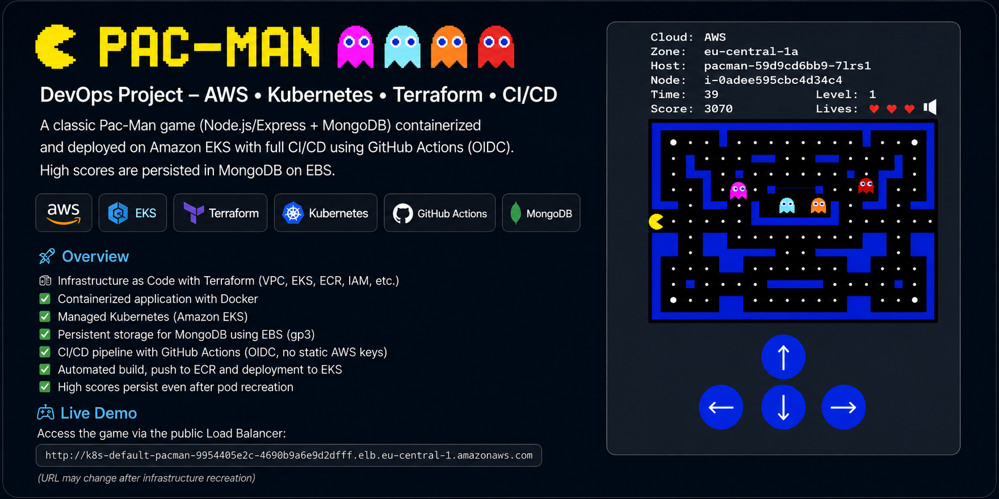

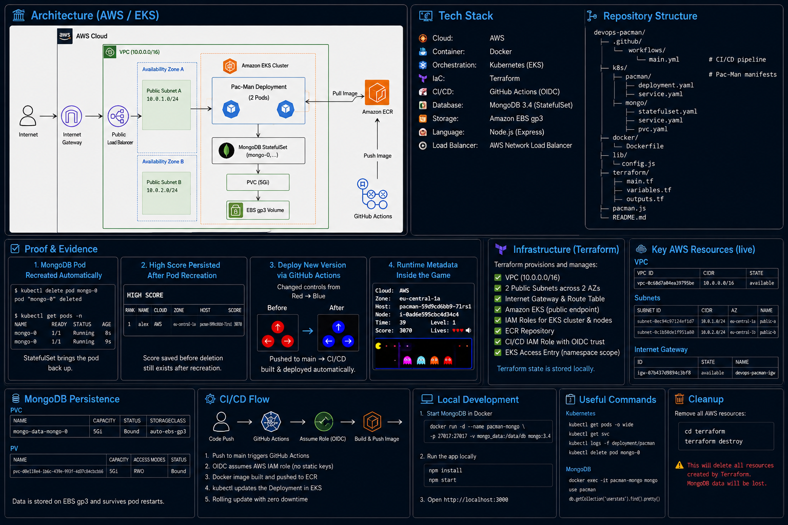

## What this project demonstrates

- **Infrastructure as Code:** VPC, networking, EKS, ECR, IAM and CI/CD access managed with Terraform.
- **Managed Kubernetes:** Pac-Man runs as a replicated Deployment; MongoDB runs as a StatefulSet.
- **Persistent state:** a 5 GiB `gp3` EBS-backed PVC preserves MongoDB data through Pod recreation.
- **Secure CI/CD:** GitHub Actions assumes an AWS IAM role through **OIDC** — no static AWS access keys are required.
- **Immutable releases:** images are built, pushed to ECR and deployed to EKS from the pipeline.
- **Self-healing:** deleting `mongo-0` causes Kubernetes to recreate it automatically.
- **Observability:** `kube-prometheus-stack` provides Prometheus, Grafana, kube-state-metrics, node-exporter and Alertmanager.
- **Runtime cloud awareness:** the application displays AWS cloud, availability zone, Pod hostname and EKS node information.

## Architecture

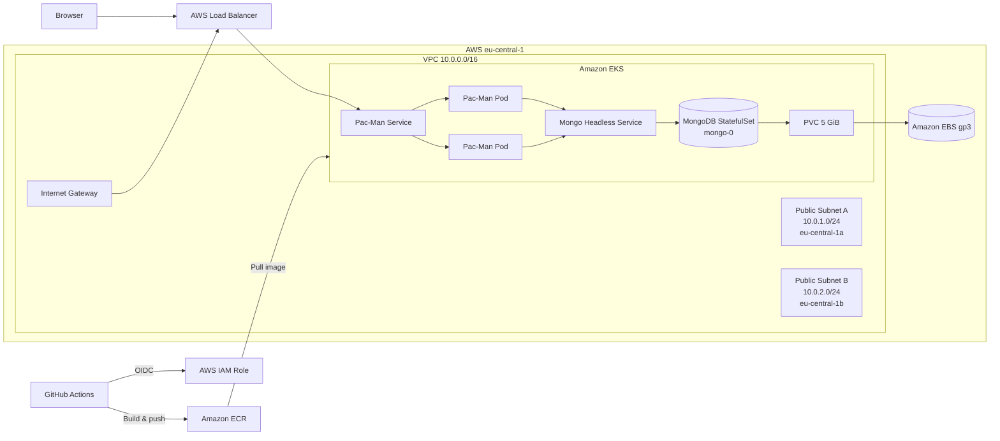

The application is publicly reachable through the Kubernetes `LoadBalancer`; MongoDB remains internal. Two public subnets span `eu-central-1a` and `eu-central-1b`. Application Pods are replaceable compute, while database state lives on EBS.

## CI/CD: source code to EKS

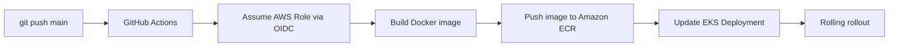

A practical end-to-end test changed the Pac-Man controls from **red to blue**, committed and pushed the change, and let the successful workflow build and deploy the new version. The high score remained after the application rollout, demonstrating separation of stateless application releases from persistent database state.

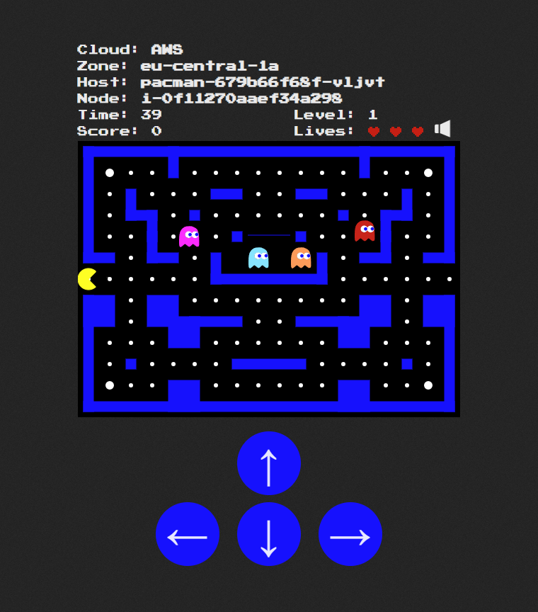

## Kubernetes & persistence proof

Observed workload state included one MongoDB Pod and two Pac-Man replicas. MongoDB uses a StatefulSet and the PVC `mongo-data-mongo-0`, bound to a **5 GiB RWO** volume using the `auto-ebs-gp3` StorageClass.

```bash
kubectl get pods -o wide
kubectl get svc
kubectl get pvc
kubectl get pv
```

### Self-healing test

`mongo-0` was deliberately deleted. Kubernetes immediately began recreating the StatefulSet Pod:

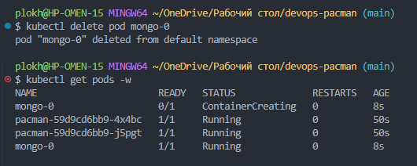

### Persistence test

A high score (`alex`, **3070**) was saved before Pod deletion and was still present after MongoDB was recreated:

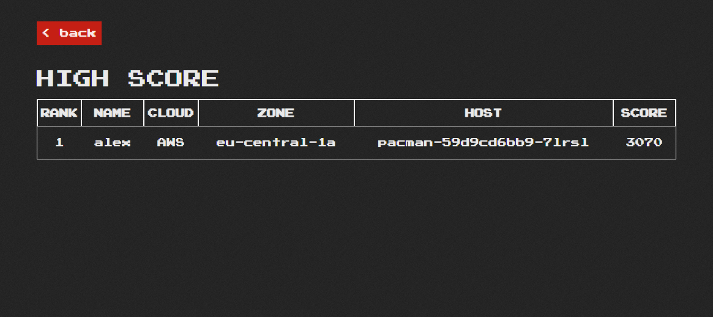

This is the important distinction: **the Pod was disposable; the data was not**.

## Runtime AWS / EKS metadata

The application exposes `/location/metadata` and displays the result in the game UI. A verified response was:

```json
{
  "cloud": "AWS",
  "zone": "eu-central-1a",
  "host": "pacman-59d9cd6bb9-7lrsl",
  "node": "i-0ade6e59cbc4d34c4"
}
```

The hostname changes as Pods roll, while the node and availability-zone information reflects the actual EKS placement rather than a hard-coded UI value.

## Monitoring: Prometheus + Grafana

Monitoring is deployed in a dedicated `monitoring` namespace with the **Prometheus Community `kube-prometheus-stack` Helm chart**.

```bash
helm install monitoring prometheus-community/kube-prometheus-stack \
  --namespace monitoring \
  -f k8s/monitoring/values.yaml

kubectl get pods -n monitoring
kubectl get svc -n monitoring
```

Verified running components included **Prometheus**, **Grafana**, **Alertmanager**, **Prometheus Operator**, **kube-state-metrics**, and **node-exporter**. Grafana is kept as a `ClusterIP` service and accessed locally through port-forwarding rather than being unnecessarily exposed to the Internet.

### Cluster overview

The Kubernetes cluster dashboard provides cluster CPU/memory utilization, namespace usage and workload-level resource visibility. The captured dashboard shows both the `default` application namespace and the separate `monitoring` namespace.

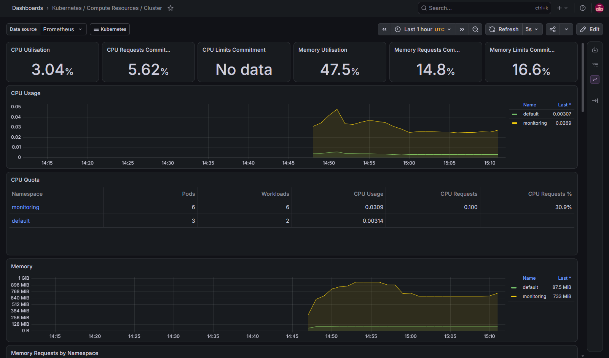

### Pod-level resources

The namespace dashboard makes the individual `mongo-0` and Pac-Man replicas visible, including CPU and memory usage. This provides direct operational evidence that the application workloads are being scraped and observed.

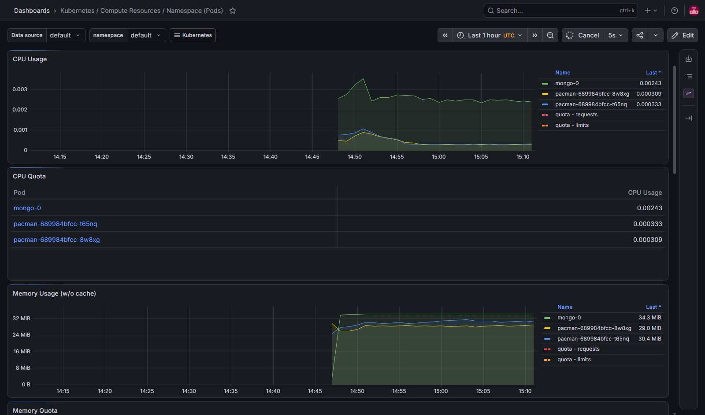

### Node metrics

Prometheus node-exporter provides host-level CPU, load average and memory telemetry for the EKS worker node. The captured dashboard shows approximately **43% memory utilization** at the time of observation.

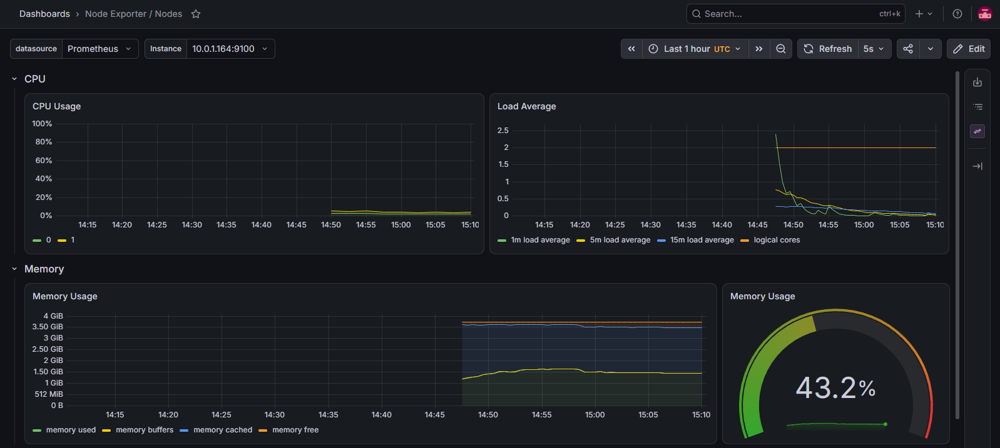

Disk I/O, disk-space and network receive/transmit metrics are also available:

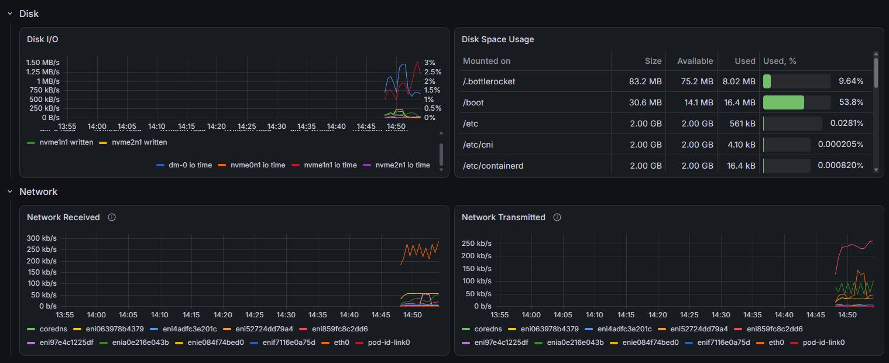

> Some request/limit panels can display `No data` when workloads do not define the corresponding Kubernetes resource requests or limits. The raw CPU/memory workload metrics are still collected and visible.

## Technology stack

| Area | Technology |
|---|---|
| Cloud | AWS |
| IaC | Terraform |
| Containers | Docker |
| Registry | Amazon ECR |
| Orchestration | Kubernetes / Amazon EKS |
| Application | Node.js / Express |
| Database | MongoDB 3.4.x |
| Persistence | Kubernetes PV/PVC + Amazon EBS gp3 |
| CI/CD | GitHub Actions |
| AWS authentication | GitHub OIDC → IAM role |
| Monitoring | Prometheus + Grafana |
| Metrics | kube-state-metrics + node-exporter |
| Alerting stack | Alertmanager |
| Package management | Helm |
| Public entry point | Kubernetes LoadBalancer / AWS load balancer |

## Repository layout

```text
devops-pacman/
├── .github/
│   └── workflows/
│       └── main.yml
├── k8s/
│   ├── pacman/
│   │   ├── deployment.yaml
│   │   └── service.yaml
│   ├── mongo/
│   │   ├── statefulset.yaml
│   │   ├── service.yaml
│   │   └── pvc.yaml
│   └── monitoring/
│       └── values.yaml
├── terraform/
│   ├── main.tf
│   ├── variables.tf
│   └── outputs.tf
├── docker/
│   └── Dockerfile
├── lib/
│   └── config.js
├── docs/
│   ├── visuals/
│   └── screenshots/
├── pacman.js
└── README.md
```

## Infrastructure as Code

Terraform manages the project's AWS foundation, including the `10.0.0.0/16` VPC, two public subnets across two AZs, Internet Gateway/routing, Amazon EKS, IAM roles for the cluster and nodes, Amazon ECR, the GitHub Actions OIDC role and EKS access.

```bash
cd terraform
terraform init
terraform validate
terraform plan
terraform apply
```

During development, existing AWS resources were reconciled with Terraform state rather than blindly duplicated. This included diagnosing an already-attached Internet Gateway and conflicting subnet CIDR — a useful real-world IaC/state-management failure mode.

## Security choices

GitHub Actions authenticates with short-lived AWS credentials through **OIDC** rather than repository-stored access keys. CI/CD uses a dedicated IAM role, EKS access is explicitly granted, and MongoDB is reachable only inside the cluster. Grafana is also kept internal by default and accessed with `kubectl port-forward`.

The legacy MongoDB 3.4 version is retained for compatibility with the supplied application; it should not be interpreted as a recommendation for a new production workload.

## Useful verification commands

```bash
# Workloads and networking
kubectl get pods -o wide
kubectl get svc

# Persistence
kubectl get pvc
kubectl get pv

# Deployed application image
kubectl get deployment pacman \
  -o jsonpath='{.spec.template.spec.containers[0].image}{"\n"}'

# Monitoring
kubectl get pods -n monitoring
kubectl get svc -n monitoring
kubectl port-forward -n monitoring svc/monitoring-grafana 3000:80

# MongoDB persistence inspection
kubectl exec -it mongo-0 -- mongo
use pacman
db.userstats.find().pretty()
```

## Engineering evidence checklist

| Capability | Evidence | Status |
|---|---|:---:|
| AWS infrastructure provisioned as code | Terraform-managed VPC/EKS/ECR/IAM resources | ✅ |
| Containerized application | Docker image stored in ECR | ✅ |
| Managed Kubernetes | Pac-Man + MongoDB running on EKS | ✅ |
| Replicated application | Two Pac-Man Pods observed | ✅ |
| Stateful database | MongoDB StatefulSet | ✅ |
| Persistent storage | 5 GiB EBS gp3 PVC/PV bound | ✅ |
| Self-healing | `mongo-0` recreated after deletion | ✅ |
| Data durability | `alex` score 3070 survived recreation | ✅ |
| Public application delivery | AWS-backed LoadBalancer service | ✅ |
| Runtime cloud metadata | AWS / AZ / Pod / node shown in app | ✅ |
| Secure CI/CD | GitHub Actions + AWS OIDC | ✅ |
| Automated release | red → blue UI change deployed by push | ✅ |
| Metrics collection | Prometheus stack running | ✅ |
| Kubernetes dashboards | Grafana cluster + namespace metrics | ✅ |
| Host telemetry | node-exporter CPU/memory/disk/network | ✅ |
| Alerting component | Alertmanager running | ✅ |

## Local development

A local MongoDB container can be used while developing the application:

```bash
docker run -d --name pacman-mongo \
  -p 27017:27017 \
  -v mongo_data:/data/db \
  mongo:3.4

npm install
npm start
```

Then open `http://localhost:3000`.

## Cleanup

To remove infrastructure created by Terraform:

```bash
cd terraform
terraform destroy
```

> **Warning:** destroying the infrastructure removes Terraform-managed AWS resources and can destroy the MongoDB EBS-backed data. Preserve anything important first.

## Original application

This project builds its DevOps/cloud implementation around Ivan Font's open-source Pac-Man application. The work in this repository focuses on containerization, AWS infrastructure, Kubernetes orchestration, persistence, CI/CD, runtime metadata and monitoring.

## Author

**Alex Plokhikh**  
DevOps Project — AWS · Terraform · Docker · Kubernetes · GitHub Actions · Prometheus · Grafana
